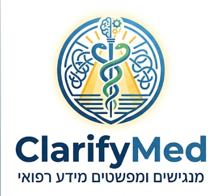

<div align="center">



# ClarifyMed
### מנגישים ומפשטים מידע רפואי

**AI-Powered Medical Visit Summarizer & Visual Presentation Generator**

*Built during a Hackathon 🏆*

[](https://react.dev)
[](https://python.org)
[](https://ai.google.dev)
[](LICENSE)

</div>

---

## Team

<table>
  <tr>
    <td align="center">
      <b>Roy Meoded</b><br/>
      Computer Science Student & Developer <br/><br/>
      <a href="https://github.com/roy3177">
        
      </a><br/>
      <a href="https://www.linkedin.com/in/roy-meoded">
        
      </a><br/>
      <a href="mailto:roymeoded2512@gmail.com">
        
      </a>
    </td>
    <td align="center">
      <b>Amit Bitton</b><br/>
      Computer Science Student & Developer<br/><br/>
      <a href="https://github.com/AmitBitton">
        
      </a><br/>
      <a href="https://www.linkedin.com/in/amit-bitton-477677353/">
        
      </a><br/>
      <a href="mailto:amituniversitymail@gmail.com">
        
      </a>
    </td>
    <td align="center">
      <b>David Kitinberg</b><br/>
      Computer Science Student & Developer<br/><br/>
      <a href="https://github.com/davidkitinberg">
        
      </a><br/>
      <a href="https://www.linkedin.com/in/david-kitinberg-744933227/">
        
      </a><br/>
      <a href="mailto:davidkitinberg@gmail.com">
        
      </a>
    </td>
  </tr>
</table>

---

## What is ClarifyMed?

Medical visit summaries are often written in complex clinical language that patients struggle to understand. **ClarifyMed** bridges that gap — patients simply upload their medical document (PDF / image) and/or an audio recording of their visit, and the app instantly produces:

- A **clear, jargon-free summary** of the visit in **5 languages**
- A **narrated visual slideshow** with keyword illustrations, AI-generated images, and synchronized subtitles

Designed to serve Israel's diverse population, with native support for Hebrew, Arabic, Russian, Amharic, and English.

---

## Features

### Document Processing
- Upload medical PDFs, images (JPG/PNG/WEBP), or plain-text files
- Upload audio recordings (MP3, WAV, M4A, OGG, WEBM) from the visit
- Supports all 4 Israeli HMOs: **Clalit · Maccabi · Meuhedet · Leumit**
- Cross-references both sources when provided

### AI Summarization
- Powered by **Google Gemini 2.5 Flash**
- Extracts diagnoses, medications & dosages, referrals, lab tests, sick leave dates
- Translates everything into 5 languages simultaneously
- Never hallucinates — omits information rather than inventing it

### Visual Presentation Player
| Feature | Details |
|---|---|
| Slide generation | 3–5 topic slides + 1 structured summary slide |
| Keyword cards | Medical terms illustrated with AI-generated 1:1 images |
| Narration | Gemini TTS with multilingual voice (Hebrew, Arabic, Russian, …) |
| Subtitles | TV-style chunks, 7 words at a time, fade-slide animation |
| Fullscreen | Native browser fullscreen with responsive layout |
| Seek bar | Click or drag to jump anywhere in the audio |
| Summary slide | All medications/diagnoses/referrals/tests grouped with icons |

---

## Tech Stack

### Frontend
| Technology | Purpose |
|---|---|
| React 18 + Vite + TypeScript | UI framework |
| Tailwind CSS | Styling |
| Framer Motion (`motion/react`) | Animations & transitions |
| Lucide React | Icons |

### Backend
| Technology | Purpose |
|---|---|
| Python 3.11 + Flask | REST API server |
| Google Gemini 2.5 Flash Lite | Text summarization & slide segmentation |
| Google Gemini TTS (`gemini-2.5-flash-preview-tts`) | Audio narration |
| Imagen (`nano-banana-pro-preview`) | Keyword card image generation |
| PyMuPDF | PDF text & structure extraction |

---

## Project Structure

```
Build_1/
├── FromDoc&AudioToTxt/          # Python backend
│   ├── server.py                # Flask API (/ api/process, /api/presentation)
│   ├── src/
│   │   ├── gemini_client.py     # Gemini text generation
│   │   ├── slide_segmenter.py   # Slide + keyword extraction
│   │   ├── tts_client.py        # Text-to-speech (PCM → WAV)
│   │   ├── image_generator.py   # Keyword card images
│   │   ├── pdf_extractor.py     # PDF parsing
│   │   ├── prompt_builder.py    # Prompt construction
│   │   ├── language_selector.py # Language routing
│   │   └── output_formatter.py  # Result formatting
│   └── outputs/                 # Saved summaries
│
└── _ClarifyMed-main/            # React frontend
    └── src/app/
        ├── App.tsx
        └── components/
            ├── InputZone.tsx         # File upload UI
            ├── ActionButton.tsx      # Generate + API calls
            └── PresentationPlayer.tsx # Full presentation player
```

---

## Getting Started

### Prerequisites
- Node.js 18+
- Python 3.11+
- Google Gemini API key → [Get one here](https://aistudio.google.com/app/apikey)

### 1. Clone the repo
```bash
git clone https://github.com/roy3177/ClarifyMed.git
cd ClarifyMed
```

### 2. Backend setup
```bash
cd FromDoc&AudioToTxt
python3 -m venv venv
source venv/bin/activate        # Windows: venv\Scripts\activate
pip install -r requirements.txt

# Create .env file
echo "GEMINI_API_KEY=your_key_here" > .env

# Start the server
python server.py
```

### 3. Frontend setup
```bash
cd _ClarifyMed-main/_ClarifyMed-main
npm install
npm run dev
```

Open [http://localhost:5173](http://localhost:5173) — the frontend proxies `/api` requests to the Flask server on port 5000.

---

## How It Works

```
User uploads PDF / audio
        ↓
Flask /api/process
  → PyMuPDF extracts text & HMO name
  → Gemini 2.5 Flash generates 5-language summary
        ↓
Flask /api/presentation
  → Gemini segments summary into slides + keywords
  → Gemini TTS narrates each slide (parallel)
  → Imagen generates keyword illustrations (parallel, 4 workers)
        ↓
PresentationPlayer renders narrated visual slideshow
```

---

## Supported Languages

| Language | Code | TTS |
|---|---|---|
| 🇮🇱 Hebrew | `he` | ✅ |
| 🇬🇧 English | `en` | ✅ |
| 🇷🇺 Russian | `ru` | ✅ |
| 🇸🇦 Arabic | `ar` | ✅ |
| 🇪🇹 Amharic | `am` | ✅ |

---

## Notes

- **Privacy:** Files are processed in a temporary directory and never stored on disk beyond the session. Gemini uploaded files are deleted immediately after processing.
- **Degradation:** If image generation fails, slides display a placeholder icon. If TTS fails, slides play silently with subtitles still available.
- **Rate limits:** Gemini TTS is called sequentially per slide to avoid rate limit errors. Image generation runs in parallel (4 workers).

---

<div align="center">
  Made with ❤️ at Hackathon 2026
</div>
